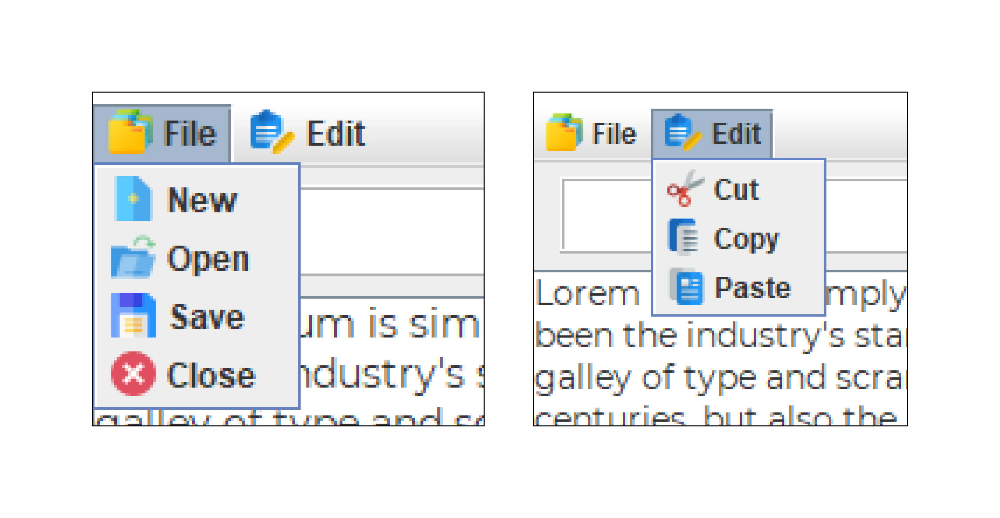

# Text-Editor-Using-Swing

<h2>About</h2>
A text editor is a type of Application that edits plain text.
<h2>Swing (GUI) </h2>
Swing is a GUI widget toolkit for Java. It is part of Oracle's Java Foundation Classes (JFC) – an API for providing a graphical user interface (GUI) for Java programs.
<h4>For more</h4> https://www.geeksforgeeks.org/creating-frames-using-swings-java/

 <h2> AWT(Abstract Window Toolkit) </h2>
It is a platform dependent API for creating Graphical User Interface (GUI) for java programs.
<h4>For more</h4>https://www.javatpoint.com/java-awt
 
<h2>Features</h2>
1.New file 
2.Save Files 
3.Open Files 
4.Copy Text 
5.Cut Text 
6.6.Paste Text 
7.Search Words/Sentence(s) 

<h1 align="center">Application Screenshot</h1>

  

  

  

